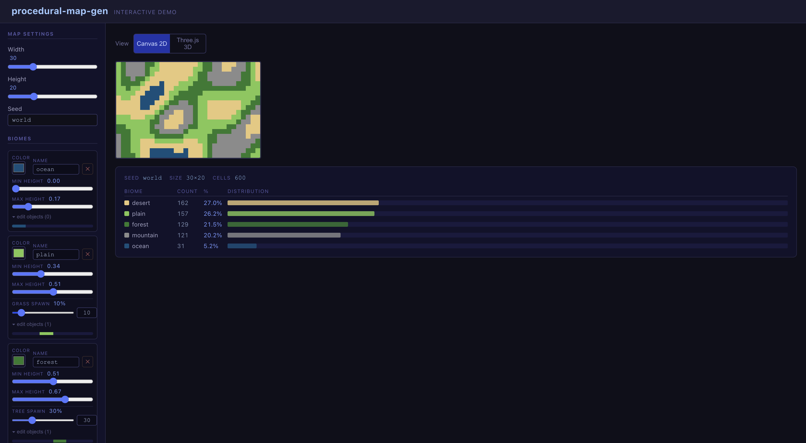
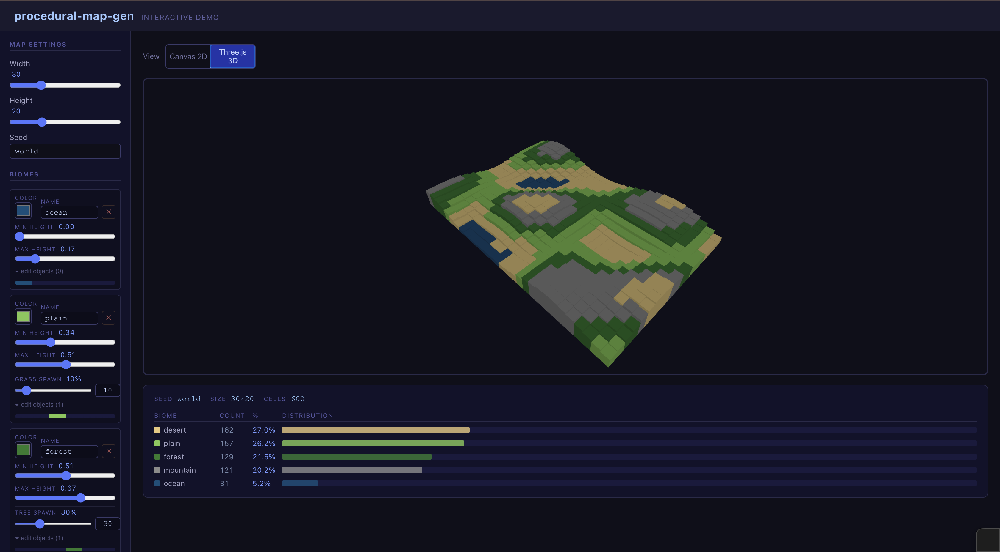

# procedural-map-gen

A deterministic procedural 2D/3D map generation library with height-based biome assignment, noise-driven terrain, and optional canvas rendering.
---

 **Learning Project** — This library was built intentionally as a learning propose.

## Preview

| 2D Map | 3D Map |
|--------|--------|
|  |  |

## Install

```bash
npm install procedural-map-gen
```

## 2D Quickstart

```ts
import { generate2DMap } from 'procedural-map-gen'

const map = generate2DMap({
  width: 40,
  height: 20,
  seed: 'my-world',
  biomes: [
    { name: 'ocean',    objects: [], heightRange: [0.0, 0.2] },
    { name: 'plain',    objects: [], heightRange: [0.2, 0.6] },
    { name: 'forest',   objects: [{ name: 'tree', probability: 30 }], heightRange: [0.6, 0.8] },
    { name: 'mountain', objects: [], heightRange: [0.8, 1.0] },
  ],
})

// map is MapCell[][]
console.log(map[0][0]) // { x: 0, y: 0, biome: 'ocean', height: 0.14, object: undefined }
```

## 3D Quickstart

```ts
import { generate3DMap } from 'procedural-map-gen'

const map = generate3DMap({
  width: 20,
  height: 20,
  depth: 4,
  seed: 'my-world',
  biomes: [
    {
      name: 'tundra',
      objects: [],
      heightRange: [0.0, 0.5],
      temperatureRange: [0.0, 0.3],
      humidityRange: [0.0, 1.0],
    },
    {
      name: 'desert',
      objects: [],
      heightRange: [0.0, 0.5],
      temperatureRange: [0.7, 1.0],
      humidityRange: [0.0, 0.3],
    },
    {
      name: 'rainforest',
      objects: [{ name: 'tree', probability: 60 }],
      heightRange: [0.0, 0.6],
      temperatureRange: [0.6, 1.0],
      humidityRange: [0.6, 1.0],
    },
    {
      name: 'mountain',
      objects: [],
      heightRange: [0.7, 1.0],
    },
  ],
})

// map is MapCell[][][]  (depth × height × width)
console.log(map[0][0][0]) // { x: 0, y: 0, z: 0, biome: 'rainforest', height: ..., temperature: ..., humidity: ... }
```

## MapConfig Reference

| Field    | Type                      | Required | Default | Description                                  |
|----------|---------------------------|----------|---------|----------------------------------------------|
| `width`  | `number`                  | yes      | —       | Number of columns                            |
| `height` | `number`                  | yes      | —       | Number of rows                               |
| `depth`  | `number`                  | 3D only  | —       | Number of layers (required for generate3DMap)|
| `seed`   | `string \| number`        | yes      | —       | Deterministic seed; same seed = same map     |
| `biomes` | `BiomeConfig[]`           | yes      | —       | At least one biome required                  |

### BiomeConfig

| Field              | Type                  | Description                                  |
|--------------------|-----------------------|----------------------------------------------|
| `name`             | `string`              | Biome identifier                             |
| `objects`          | `ObjectConfig[]`      | Spawn rules for objects in this biome        |
| `heightRange`      | `[number, number]`    | `[min, max]` height match (0–1, optional)    |
| `temperatureRange` | `[number, number]`    | `[min, max]` temperature match (0–1, optional)|
| `humidityRange`    | `[number, number]`    | `[min, max]` humidity match (0–1, optional)  |

### ObjectConfig

| Field         | Type     | Description                                      |
|---------------|----------|--------------------------------------------------|
| `name`        | `string` | Object identifier                                |
| `probability` | `number` | Spawn chance 0–100                               |
| `minHeight`   | `number` | Minimum cell height for spawn (optional)         |
| `maxHeight`   | `number` | Maximum cell height for spawn (optional)         |

## CLI

```bash
# Print ASCII map to stdout
npx pmg --width 40 --height 20 --seed myseed --format ascii

# Output JSON
npx pmg --width 10 --height 10 --seed myseed --format json

# 3D map (4 layers)
npx pmg --width 20 --height 10 --depth 4 --seed myseed

# Write to file
npx pmg --width 40 --height 20 --seed myseed --output map.txt
```

### CLI Options

| Option     | Default  | Description                          |
|------------|----------|--------------------------------------|
| `--width`  | `20`     | Map width                            |
| `--height` | `10`     | Map height                           |
| `--seed`   | `world`  | Seed string                          |
| `--depth`  | —        | Enable 3D mode with given depth      |
| `--format` | `ascii`  | `ascii` or `json`                    |
| `--output` | —        | Write output to file instead of stdout|
| `--help`   | —        | Show help message                    |

## Canvas Rendering

```ts
import { generate2DMap } from 'procedural-map-gen'
import { renderMap } from 'procedural-map-gen/canvas'

const canvas = document.getElementById('map') as HTMLCanvasElement
const map = generate2DMap({ width: 100, height: 80, seed: 'demo', biomes: [...] })

renderMap(canvas, map, {
  cellSize: 8,          // pixels per cell (default: 8)
  showObjects: true,    // render object dots (default: false)
  colorMap: {           // override default colors
    ocean: '#003366',
    plain: '#55aa33',
  },
})
```